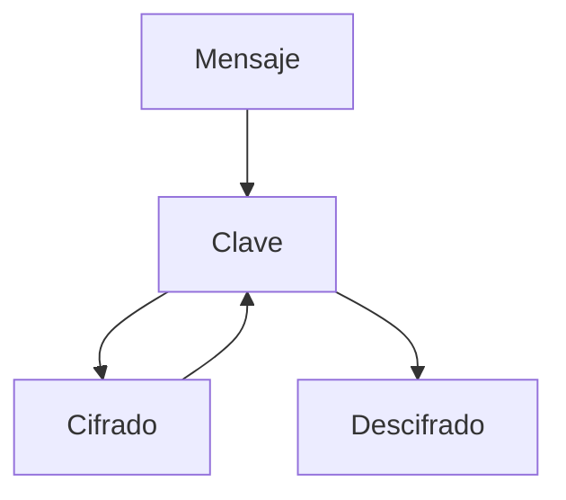
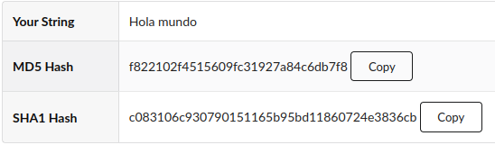
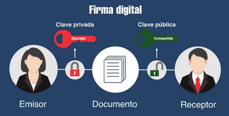
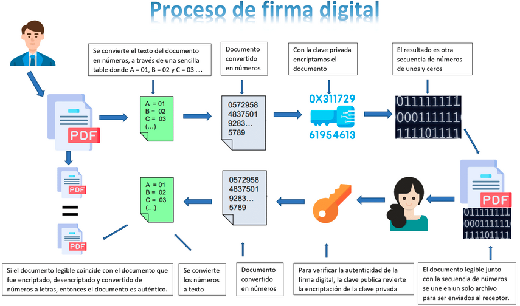

# Criptografía Informática Básica

- [Criptografía Informática Básica](#criptografía-informática-básica)
  - [Conceptos Básicos](#conceptos-básicos)
    - [Comunicación Segura](#comunicación-segura)
  - [Criptografía Simétrica](#criptografía-simétrica)
    - [Tipos de Cifrado Simétrico](#tipos-de-cifrado-simétrico)
      - [Cifrado por Flujo](#cifrado-por-flujo)
      - [Cifrado por Bloque](#cifrado-por-bloque)
  - [Criptografía Asimétrica](#criptografía-asimétrica)
  - [HASH en Criptografía](#hash-en-criptografía)
    - [Algoritmo para HASH](#algoritmo-para-hash)
  - [¿Por qué un HASH protege las contraseñas?](#por-qué-un-hash-protege-las-contraseñas)
    - [Enlaces a web con el uso del HASH](#enlaces-a-web-con-el-uso-del-hash)
    - [Caracterísiticas básicas de los algoritmos HASH](#caracterísiticas-básicas-de-los-algoritmos-hash)
  - [Qué es la Firma Digital](#qué-es-la-firma-digital)
  - [Cómo funciona la red TOR y la DEEP WEB](#cómo-funciona-la-red-tor-y-la-deep-web)
    - [Instalar TOR Browser](#instalar-tor-browser)
  - [Estenografía](#estenografía)
  - [Red P2P](#red-p2p)

- - -

## Conceptos Básicos

No es lo mismo Codificar que Cifrar.

_Codificar_: siempre se realiza de la misma forma. Como pueden ser las traducciones del lenguaje. Por tanto es fijo.

_Cifrar_: el cifrado cambia, incluso para la misma palabra. No siempre da el mismo resultado para la misma palabra que se cifra. Por tanto es variable.

La _criptografía_ se basa en dos técnicas_: la _permutación_ y la _sustitución_.

- _Permutación_: es la técnica que se encarga de cambiar de orden los elementos de un mensaje.
- _Sustitución_: es la técnica que se encarga de sustituir los elementos por otros relacionados de alguna forma (depende del tipo de cifrado).

Estas técnicas por separado son bastantes frágiles, por lo que, lo interesante es juntarlas. Obteniendo así, los beneficios de las dos técnicas.

En la criptografía la seguridad reside en la _clave_ de cifrado no el algoritmo de cifrado.

Los _algoritmo de cifrado_ son públicos y se pueden ver, analizar, implementar.

Se distinguen dos tipos de criptografía:

- _Simétrica_: cuando las claves son iguales, tanto para el receptor como para el transmisor.
- _Asimétrica_ o de _clave pública_: tiene una clave para cifrar y otra diferente para descifrar.

### Comunicación Segura

Para conseguir una comunicación segura, debe existir _confidencialidad_ entre emisor y receptor.

Debe existir _autenticación_, tanto en el emisor como el receptor deben saber la identidad del otro (que no es un farsante).

La _integridad_ del mensaje, es una característica que asegura que el mensaje no ha sido alterado.

El _no repudio_ está ligado a la autenticación, ya que es una característica que tiene el receptor; cuando recibe un mensaje, puede rechazarlo si lo considera.

Por último, el _acceso_ y _disponibilidad_ del servicio y los datos deben estar dispuestos siempre que se soliciten. Sirve para evitar la denegación de un servicio.

## Criptografía Simétrica

Es la que utiliza las mismas claves para cifrar que para descifrar.




El receptor debe tener la clave, al igual que el emisor. Esto es un problema, ya que si envío la clave al receptor por un medio no seguro puede ser interceptada.

### Tipos de Cifrado Simétrico

- El cifrado _bloque_. Consiste en segmentar la información por bloques y cifrarlo. Luego se juntan en un solo bloque único.
- El cifrado _por flujo_. El cifrado se realiza bit a bit, palabra a palabra.

#### Cifrado por Flujo


#### Cifrado por Bloque


## Criptografía Asimétrica

Este tipo de cifrado usa una clave para el cifrado y otra diferente para el descifrado. Cada usuario (emisor y receptor) tienen un par de claves:

- _Clave Pública_. Es conocida por todos, no es secreta.
- _Clave Privada_. Esta es secreta y única para cada persona.

Ambas claves son complementarias. Si cifras con la _clave pública_, puedes descrifrar con la _clave privada_, y viceversa. Son complementarias entre sí.

Para la _confidencialidad_ debemos cifrar con la _clave pública_ de la persona a la que vamos a enviar el mensaje. De esta forma, solo el receptor que tiene la _clave privada_ podrá descrifrar el mensaje.

Para la _autenticación_ (el emisor) firmará con la _clave privada_ para que cualquier otra persona a la que enviaremos el mensaje, con nuestra _clave pública_ pueda descrifrar el mensaje. Y así averiguar que somo nosotros (el emisor) el que le hemos enviado el mensaje.


## HASH en Criptografía

En un **HASH** en Criptografía siempre sale la misma cadena de bits, independientemente del tamaño del archivo a codificar. El resultado de un **HASH** es de 256 bits.

Sirve además para generar un identificador único del archivo. Habrá un **HASH** por cada palabra o archivo.

- **HASH** no utiliza clave.
- Cifrado si utiliza clave.

### Algoritmo para HASH

1. Determinar número de letras de la palabra de entrada y numerarlos empezando por el uno.
2. Sumar la primera y última letra. El resultado es la primera parte del HASH.
3. Sumar las posiciones pares, multiplicar por el sumatorio de las posiciones impares. Si el resultado es un número de dos cifras, dividir entre 10 y redondear a la baja. El resultado es el segundo número del HASH.
4. Elevar al cuadrado los valores numéricos de las letras que conforman la palabra y sumarlos. Si el resultado es de dos cifras, dividir por 10 y redondear a la baja.
5. Sumar primera y segunda posición y dividir entre el número de letras. Redondear al entero más próximo. Este es el último paso para crear el HASH.

El proceso de crear un **HASH** a partir de una palabra, es _unidireccional_. No se puede obtener la palabra a partir del **HASH**.

La otra particularidad de los **HASH** es que son únicos. Nunca habrá dos mensajes con el mismo **HASH** utilizando el mismo algoritmo.

Otra propiedad que tienen los **HASH** es que cambiando 1 bit de la palabra, el **HASH** debe cambiar solo la mitad.

Los algoritmos para **HASH** más conocidos en el mundo son:

- **MD5**. Algoritmo que fue crackeado.
- **SHA1**. Algoritmo que fue crackeado.
- **SHA256**. Algoritmos utilizado actualmente como estándar.

```python
import hashlib
class HASH:
  def generaHash(h):
    digest=h.hexdigest()
    return digest

x=0
while x<1:
  print("Elegir el algoritmo a usar: ")
  print("1) SHA256")
  print("2) SHA512")
  print("3) Fin programa")
  nAlgoritmo=int(input())
  print("Intro palabra: ")
  datos=input()
  algoritmo=""

  if nAlgoritmo != 3:
    if nAlgoritmo == 1:
      algoritmo="sha256"
    elif nAltogitmo == 2:
      algoritmo="sha512"
    
    bdatos = bytes(datos,'utf-8')
    h = hashlib.new(algoritmo, bdatos)
    hash1 = HASH.generaHash(h)
    print()
    print(hash)
    print()
    x=0
  else:
    x=1

pritn("FIN")
```

## ¿Por qué un HASH protege las contraseñas?

En una página web, al loguearse con el usuario y la contraseña. Si en el código HTML cambiamos la propiedad _password_ por la de _txt_ podríamos ver el texto en claro de la contraseña. Para evitar este inconveniente se utilizan los **HASH**.

El **HASH** es único e irrepetible para cada texto de entrada. Un ejemplo del uso de **HASH** para codificar la frase _hola mundo_ es el siguiente:



Por tanto, son muy útiles para aplicar el **HASH** sobre contraseñas cifradas. Nunca a partir del **HASH** se podrá obtener la contraseña, no es reversible.

### Enlaces a web con el uso del HASH

En la siguiente página web [Crack HASH](https://crackstation.net/) permite obtener la contraseña a partir del **HASH** usando fuerza bruta.

Una web con un generador de **HASH**: [MD5 Hash Generator](https://www.md5hashgenerator.com/).

### Caracterísiticas básicas de los algoritmos HASH

- **MD5**: la longitud del resumen resultante es de 128 bits. Es vulnerable.
- **SHA1**: la longitud del resumen resultante es de 160 bits. Es vulnerable.
- **SHA256**: la longitud del resumen resultante es de 256 bits. No es vulnerable.
- **SHA512**: la longitud del resumen resultante es de 512 bits. No es vulnerable.

| Caracterísitca | Función HASH | Cifrado |
| --- | --- | --- |
| Propósito | Resumir/Verificar integridad | Proteger confidencialidad |
| Reversibilidad | Irreversible | Reversible (con clave) |
| Uso de clave | No | Si |
| Salida | Longitud fija | Variable, basada en la entrada |
| Uso común | Verificación de datos | Protección de información privada |
| Algoritmos típicos | MD5, SHA-256 | AES, RSA |

## Qué es la Firma Digital

La **Firma Digital** utiliza el **HASH**. Por lo que, es un proceso o mecanismo que permite a un receptor del mensaje, validar la identidad o el origen del mensaje mandado por el transmisor.

La **Firma Digital** aporta:

- _Autenticación_. Confirmación de la persona propietaria del mensaje.
- _No repudio_. Aceptación del mensaje cuando viene de una fuente fiable.

La **Firma Digital** se basa en la criptografía de _clave asimétrica o pública/privada_.



- - -



Los pasos para la realización de la **Firma Digital** y posterior _autenticación_ y _no repudio_ son los siguientes:

- Alice envía mensaje a Bob. Para ello el texto lo convierte en **HASH** y luego lo codifica con la **clave privada**.
- Bob recibe el mensaje enviado por Alice. Para recuperar el texto, descrifra con la **clave pública** obteniendo el **HASH** validando así que es Alice el propietario.

## Cómo funciona la red TOR y la DEEP WEB

La arquitectura _cliente/servidor_ es la estándar. Desde el _cliente_ se realizan las peticiones al _servidor_, el cual, devuelve lo solicitado.

La arquitectura _onion routing_ (enrutamiento cebolla) se basa en las capas, varios servidor procesando la información solicitada. En cada uno de los servidores, se tiene una IP diferente. El objetivo es el _anonamito_.

Se tiene que utilizar un navegador específico, como es **TOR**.

### Instalar TOR Browser

1. En buscador escribir _Tor_ y hacer clic en _The Project | Anonymity Online_.
2. Clic en _Download Tor Browser_. Y hacer clic en _Download for linux_.
3. Guardar _Save file as_ y en la carpeta de descarga veremos el fichero con extensión _.tar_
4. Para descomprimir, escribir: `tar -xf tor-browserxxxx.tar.xz`.
5. Entramos en la carpeta que se ha descomprimido, con el comando: `cd tor-browser`.
6. Dentro de la carpeta, aparece un archivo y para ejecutarlo escribir: `./start-tor-browser.sh`.
7. En la ventana que aparece, hacemos clic en _Connect_. Comenzará a establecer la conexión y al final del proceso, se abre el navegador.
8. Para instalarlo desde la terminal: `sudo apt-get update` y para instalar `sudo apt-get install tor torbrowser-launcher`.
9. Para lanzar **TOR** escribimos el comando en el terminal: `torbrowser-launcher`. La primera vez tarda un tiempo por las verificaciones de la firma.
10. Una vez termina la verificación, sale una ventana en la haremos clic en _Connect_.
11. Una vez instalada, en aplicaciones,salen el buscador _Tor Browser_ y _Tor Browser Launcher_ que sirver para acceder de forma gráfica.

## Estenografía

Insertar en una imagen un archivo sin alterar la imagen. Queda escondido dentro de la imagen. Cuanto más grande sea el archivo portador, más datos podremos ocultar en él.

El archivo de imagen no funciona si tiene la extensión _png_. Debe ser _jpeg_ o _jpg_.

Se utiliza la aplicación de terminal en Linux _steghide_.

- Para incluir un archivo de texto dentro de un fichero de imagen: `steghide embed -cf imagen.jpg -ef texto.txt`. Nos pide contraseña y su confirmación.
- Para extraer archivo que está oculto en fichero de imagen: `steghide extract -sf imagen.jpg`.
- Si tenemos un archivo zip con contraseña lo pasamos a _Hash_ para utilizar la herramienta _John_ y crackearla: `zip2john backup.zip > hash`.
- Para usar la herramienta _John_ sobre el archivo _hash_: `john --wordlist=/usr/share/wordlists/rockyou.txt hash`.

## Red P2P

Las arquitecturas de red describen cómo se organizan y comunican los dispositivos y aplicaciones dentro de una red. La arquitectura _peer-to-peer (P2P)_ no existe un servidor único que provee de los datos al resto de dispositivos que los solicitan, sino que cada PC actúa como servidor y como cliente en el proceso de intercambio de información.

Existe la arquitectura _híbrida_ entre la _P2P_ y la de _cliente/servidor_.

El la arquitectura _P2P_ los datos están descentralizados, estando repartidos en los dispositivos que están interconectados en ese instante.
