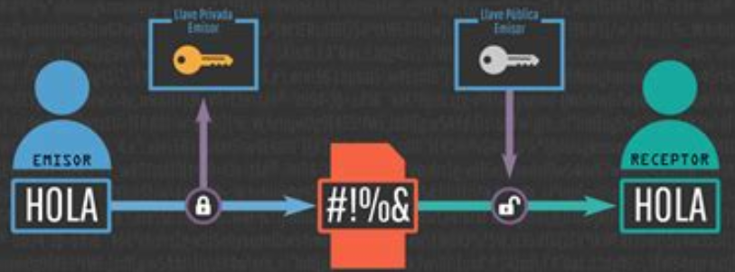
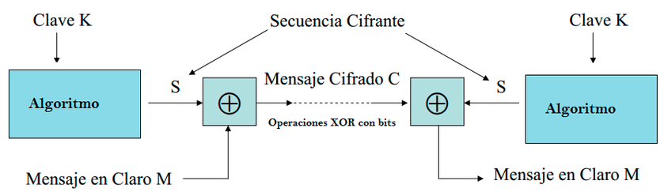
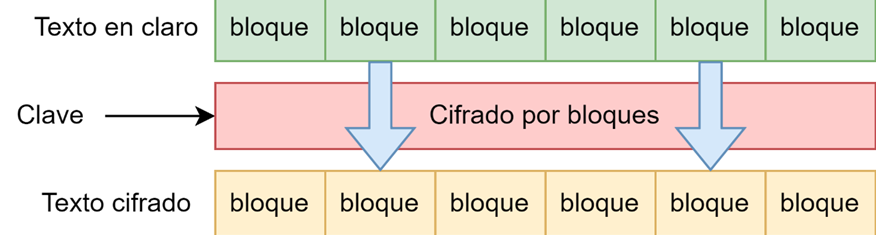
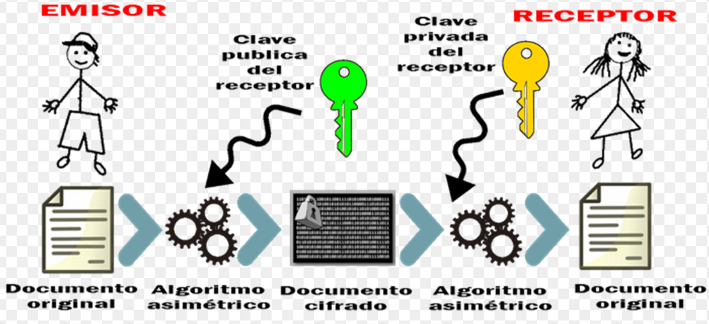
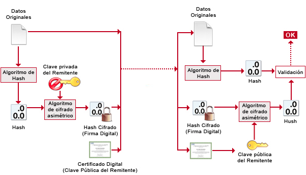

# Criptografía Informática Básica

- [Criptografía Informática Básica](#criptografía-informática-básica)
  - [Conceptos Básicos](#conceptos-básicos)
    - [Comunicación Segura](#comunicación-segura)
  - [Criptografía Simétrica](#criptografía-simétrica)
    - [Tipos de Cifrado Simétrico](#tipos-de-cifrado-simétrico)
      - [Cifrado por Flujo](#cifrado-por-flujo)
      - [Cifrado por Bloque](#cifrado-por-bloque)
  - [Criptografía Asimétrica](#criptografía-asimétrica)

- - -

## Conceptos Básicos

No es lo mismo Codificar que Cifrar.

_Codificar_: siempre se realiza de la misma forma. Como pueden ser las traducciones del lenguaje. Por tanto es fijo.

_Cifrar_: el cifrado cambia, incluso para la misma palabra. No siempre da el mismo resultado para la misma palabra que se cifra. Por tanto es variable.

La _criptografía_ se basa en dos técnicas_: la _permutación_ y la _sustitución_.

- _Permutación_: es la técnica que se encarga de cambiar de orden los elementos de un mensaje.
- _Sustitución_: es la técnica que se encarga de sustituir los elementos por otros relacionados de alguna forma (depende del tipo de cifrado).

Estas técnicas por separado son bastantes frágiles, por lo que, lo interesante es juntarlas. Obteniendo así, los beneficios de las dos técnicas.

En la criptografía la seguridad reside en la _clave_ de cifrado no el algoritmo de cifrado.

Los _algoritmo de cifrado_ son públicos y se pueden ver, analizar, implementar.

Se distinguen dos tipos de criptografía:

- _Simétrica_: cuando las claves son iguales, tanto para el receptor como para el transmisor.
- _Asimétrica_ o de _clave pública_: tiene una clave para cifrar y otra diferente para descifrar.

### Comunicación Segura

Para conseguir una comunicación segura, debe existir _confidencialidad_ entre emisor y receptor.

Debe existir _autenticación_, tanto en el emisor como el receptor deben saber la identidad del otro (que no es un farsante).

La _integridad_ del mensaje, es una característica que asegura que el mensaje no ha sido alterado.

El _no repudio_ está ligado a la autenticación, ya que es una característica que tiene el receptor; cuando recibe un mensaje, puede rechazarlo si lo considera.

Por último, el _acceso_ y _disponibilidad_ del servicio y los datos deben estar dispuestos siempre que se soliciten. Sirve para evitar la denegación de un servicio.

## Criptografía Simétrica

Es la que utiliza las mismas claves para cifrar que para descifrar.

El receptor debe tener la clave, al igual que el emisor. Esto es un problema, ya que si envío la clave al receptor por un medio no seguro puede ser interceptada.

### Tipos de Cifrado Simétrico

- El cifrado _bloque_. Consiste en segmentar la información por bloques y cifrarlo. Luego se juntan en un solo bloque único.
- El cifrado _por flujo_. El cifrado se realiza bit a bit, palabra a palabra.

#### Cifrado por Flujo

#### Cifrado por Bloque

## Criptografía Asimétrica

Este tipo de cifrado usa una clave para el cifrado y otra diferente para el descifrado. Cada usuario (emisor y receptor) tienen un par de claves:

- _Clave Pública_. Es conocida por todos, no es secreta.
- _Clave Privada_. Esta es secreta y única para cada persona.

Ambas claves son complementarias. Si cifras con la _clave pública_, puedes descrifrar con la _clave privada_, y viceversa. Son complementarias entre sí.

Para la _confidencialidad_ debemos cifrar con la _clave pública_ de la persona a la que vamos a enviar el mensaje. De esta forma, solo el receptor que tiene la _clave privada_ podrá descrifrar el mensaje.

Para la _autenticación_ (el emisor) firmará con la _clave privada_ para que cualquier otra persona a la que enviaremos el mensaje, con nuestra _clave pública_ pueda descrifrar el mensaje. Y así averiguar que somo nosotros (el emisor) el que le hemos enviado el mensaje.

